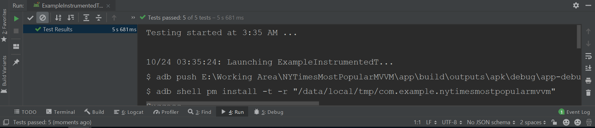

# MVVM-NY-Times-Most-Popular-Articles-Android
MVVM-NY-Times-Most-Popular-Articles-Android is MVVM sample project which shows popular news which is fetch from NY Times API.

**This application was done using MVVM + RXJava2 + Dagger2 + Live Data.**

- MVVM Design Architecture used.
- RXJava2.
- Dagger2.
- Retrofit.
- Data Fetch from NY Times Popular Api
- Test Driven Development(Junit-espresso).


## Screenshots

**Please click the image below to enlarge.**


<p>


</p>


## UI Testing Screenshot





## Unit Testing Screenshot


## Code Coverage
A coverage report can be generated using `gradlew createDebugCoverageReport`command-line via Gradle
Then you can find it at  `app\build\reports\coverage\debug\index.html` 


## Contributing

Please fork this repository and contribute back using
[pull requests](https://github.com/tayyabtariq50/MVVM-NY-Times-Most-Popular-Articles-Android/pulls).

Any contributions, large or small, major features, bug fixes, are welcomed and appreciated
but will be thoroughly reviewed .

## License

* [Apache Version 2.0](http://www.apache.org/licenses/LICENSE-2.0.html)

```
Copyright 2019 Tayyab Tariq

Licensed under the Apache License, Version 2.0 (the "License");
you may not use this file except in compliance with the License.
You may obtain a copy of the License at

 http://www.apache.org/licenses/LICENSE-2.0

Unless required by applicable law or agreed to in writing, software
distributed under the License is distributed on an "AS IS" BASIS,
WITHOUT WARRANTIES OR CONDITIONS OF ANY KIND, either express or implied.
See the License for the specific language governing permissions and
limitations under the License.

